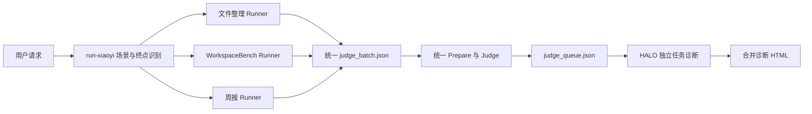

# 小艺批跑 Skills 使用手册

本文适用于 `E:\hw\weekly_report_batch` 下的最新版 Skills，覆盖文件整理、
WorkspaceBench、周报/日报三种任务，以及 Runner、Judge、HALO 三阶段流程。

## 1. 最快使用方式

安装全部六个 Skill 后，日常只需要调用 `$run-xiaoyi`，并在请求中说清楚：

1. 数据或已有产物在哪里；
2. 要执行哪些 Case、Task 或人员；
3. 流程停止在 Runner、Judge，还是 HALO。

示例：

```text
使用 $run-xiaoyi 批量运行文件整理任务。
任务列表在 E:\data\selected_cases.json，任务数据集在 E:\data\test_file，
任务 prompts 在 E:\data\prompts。只执行 Runner，不执行 Judge 和诊断。
```

```text
使用 $run-xiaoyi 运行 E:\data\task 下的 Task 112、113，
完成 Runner 后统一进行 Judge，不执行 HALO 诊断。
```

```text
使用 $run-xiaoyi 运行 E:\weekly_data 中何沐的 Task 21、22，
完成 Runner、Judge 和 HALO，并生成合并诊断 HTML。
```

## 2. Skill 组成与职责

| Skill | 作用 | 是否建议用户直接调用 |
| --- | --- | --- |
| `run-xiaoyi` | 唯一总入口；识别场景并控制 Runner、Judge、HALO | 是，首选 |
| `xiaoyi-auto-continue` | 文件整理 Runner；处理同一对话中的二次确认 | 仅明确只跑文件整理 Runner 时 |
| `run-xiaoyi-loop` | 数字 Task、WorkspaceBench Runner | 仅明确只跑数字 Task Runner 时 |
| `xiaoyi-weekly-report` | 周报、日报和指定时间段报告 Runner | 仅明确只跑周报 Runner 时 |
| `judge-xiaoyi-results` | 对冻结的本地产物统一 Prepare、评分、汇总 | Judge-only 或开发调试时 |
| `halo-rlm-agent-driven` | 基于 Trace 和 Judge 结果做本地 HALO 诊断 | HALO-only 或开发调试时 |

`run-xiaoyi-loop` 虽然名称中带 `run`，但不是总入口；总入口始终是
`run-xiaoyi`。

## 3. 安装

### 3.1 推荐安装结构

六个 Skill 必须作为同级目录一起安装，因为总入口会按准确名称寻找子 Skill：

```text
<skills_root>/
├── run-xiaoyi/
├── run-xiaoyi-loop/
├── xiaoyi-auto-continue/
├── xiaoyi-weekly-report/
├── judge-xiaoyi-results/
└── halo-rlm-agent-driven/
```

每个目录都必须完整复制，不能只复制 `SKILL.md`；其中的 `scripts/`、
`assets/`、`references/` 和 `agents/openai.yaml` 也是运行依赖。

Codex 官方支持将仓库级 Skill 放在 `$REPO_ROOT/.agents/skills`，或将个人
Skill 放在 `$HOME/.agents/skills`。Skill 是包含 `SKILL.md` 及可选脚本、
引用和资源的目录；Codex 可通过 `$skill-name` 显式调用，也可根据
`description` 自动匹配。详情见 [OpenAI Codex Build skills](https://developers.openai.com/codex/build-skills)。

本目录当前是一组独立 Skills，不包含 `.codex-plugin/plugin.json`。如果只在
本机或仓库内使用，直接复制六个目录即可；若要面向其他用户统一分发，再封装成
Plugin。

复制后若 Agent 没有发现新 Skill，重启 Codex 或对应 Agent 会话。

### 3.2 调用策略

- `$run-xiaoyi` 允许隐式匹配，但推荐显式写出，避免错误路由。
- 三个 Runner 子 Skill 默认禁止隐式调用，应由 `run-xiaoyi` 选择。
- 直接调用子 Skill 时，它只负责自身阶段，不会自动补齐完整流程。

## 4. 环境要求

- Windows 和 PowerShell；其他系统需要自行适配 HDC 路径及命令写法。
- Python 3.10 或以上。
- 工作机可执行 `hdc list targets`，并且只连接或明确指定一台鸿蒙 PC。
- 鸿蒙 PC 已安装并可启动小艺：`com.huawei.hmos.vassistant`。
- Agent 对业务数据目录和运行 workspace 有读写权限。
- Runner 运行期间保持设备在线，不要人工切换、关闭或操作同一个小艺会话。
- Judge 和 HALO 不需要外部 Judge API key 或额外 LLM API key。

运行产物必须写到 Agent workspace 或用户指定的外部目录，不能写进已安装
Skill，也不能写进源数据集。

<<<<<<< HEAD
最新版默认采用“任务优先”目录：文件整理使用完整 Case ID，WorkspaceBench
数字任务使用 `task<ID>`，周报使用原始 `metadata.absolute_id`（可为非数字且
不添加 `task` 前缀）。同一任务的三个阶段集中在一个目录，批次公共文件单独保存：
=======
最新版默认采用“任务优先”目录：文件整理使用完整 Case ID，数字任务使用
`task<ID>`。同一任务的三个阶段集中在一个目录，批次公共文件单独保存：
>>>>>>> 874a79aed3a126240813fa65fc8adbbee74439cb

```text
<agent_workspace>/
├── <task_key>/
│   ├── xiaoyi_file_runs/
│   ├── xiaoyi_judge/
│   └── xiaoyi_halo/
└── _xiaoyi_batches/run_<YYYYMMDD>/
    ├── runner_batch.json | weekly_runner_batch.json
    ├── pipeline_state.json
    ├── judge_batch.json
    ├── judge_queue.json
    ├── batch_summary.json
    ├── halo_agent_queue.json
    └── batch_diagnosis_report.html
```

只执行到某个阶段时，后续目录和文件不会创建。旧版显式输出路径仍可读取和
Judge，但新运行不再默认创建 workspace 根部的阶段优先目录。

## 5. 总体流程



关键阶段边界：

- 整个选定 Runner 批次结束后，才能启动 Judge。
- 整个 Judge 批次结束后，才能启动 HALO。
- 文件整理 Case 严格串行；同一 Case 的二次确认完成后才能运行下一 Case。
- 周报按人员、按 Task 严格串行。
- Runner-only 不读取 rubrics 判定业务正确性。

## 6. 如何决定流程终点

| 用户表达 | 实际阶段 |
| --- | --- |
| “运行任务”“批跑任务”“只运行” | 只执行 Runner |
| “运行并 Judge/评分/打分” | Runner → Judge |
| “运行并 Judge 和诊断”“完成 HALO” | Runner → Judge → HALO |
| 提供现有 `judge_batch.json` | 跳过 Runner，从 Judge 开始 |
| 提供现有 `judge_queue.json` | 跳过 Runner/Judge，直接 HALO |
| 只提供一条明确 JSONL Trace | 只做该 Trace 的 HALO，不操作设备 |

默认终点是 Runner-only。没有明确说 Judge，就不会自动评分；没有明确说诊断，
就不会自动运行 HALO。

“只运行”与“并进行 Judge/诊断”同时出现属于冲突请求，Agent 应在操作 HDC 前
先澄清。

## 7. 场景路由规则

| 场景 | 关键识别依据 | Runner |
| --- | --- | --- |
| 文件整理 | `FileOrganization_<n>_<n>`，并有 setup/expect/source/prompt | `xiaoyi-auto-continue` |
| 周报/日报 | 周报、日报、`deliverables_final/`，或 `adapter: weekly-report` | `xiaoyi-weekly-report` |
| WorkspaceBench | 数字 ID，metadata 中有非空 `task` 和 `rubrics` | `run-xiaoyi-loop` |

Schema 优先于模糊的目录名或口语描述：

- `FileOrganization_0_001` 必须保留完整 ID，不能把末尾 `001` 当作数字 Task。
- 单独出现英文 `task` 不足以判定 WorkspaceBench，必须有数字选择器或 metadata。
- 一次批次只能包含一种 adapter；混合场景必须拆成不同批次。
- 周报 Task ID 必须在所有人员间全局唯一。

## 8. 文件整理任务

### 8.1 数据格式

```text
<project>/
├── selected_cases.json             # 可选；JSON 数组，由 Agent 读取
├── prompts/
│   ├── FileOrganization_0_001.txt
│   └── FileOrganization_0_002.txt
└── test_file/
    ├── FileOrganization_0_001/
    │   ├── metadata.json
    │   ├── setup.json
    │   ├── expect.json
    │   └── source/
    └── FileOrganization_0_002/
        └── ...
```

每个 Case 必须存在 `setup.json`、`expect.json`、`source/` 和对应 prompt。
当 `setup.json.file_send` 为空时，`source/` 才允许为空。

### 8.2 推荐对 Agent 的说法

只运行：

```text
使用 $run-xiaoyi 运行文件整理任务。
任务列表在 E:\data\selected_cases.json，数据集在 E:\data\test_file，
prompts 在 E:\data\prompts。只执行 Runner。
```

运行并 Judge：

```text
使用 $run-xiaoyi 批量运行以上文件整理任务；全部 Case 完成后统一进行 Judge，
不要进行 HALO 诊断。
```

完整流程：

```text
使用 $run-xiaoyi 批量运行以上文件整理任务；全部 Runner 完成后统一 Judge，
Judge 全部完成后进行 HALO 诊断并生成合并 HTML。
```

### 8.3 Runner 实际过程

1. Agent 读取 Case 列表、校验所有输入，并固定当天 `YYYYMMDD` run ID。
2. 第一条尚未运行的 Case Round 0 前，通过内置 helper force-stop 小艺一次。
3. Round 0 清理 PC 的 Desktop、Download、Documents，再按 `setup.json` 推送源文件。
4. 推送原始 prompt，等待当前主 Agent 的 `stop_reason=stop`。
5. 拉取当前 JSONL、最新 `content.txt` 和三个目录快照。
6. Agent 根据最新回复语义判断任务是否真正完成。
7. 如小艺仍在请求确认、选择方案或报告可恢复失败，Agent生成肯定性 query，
   使用同一个 `dialog_page_id` 继续历史对话。
8. 每条 Case 最多四次推送：Round 0 加三轮 continue。
9. Case 得到最终 outcome 后才会进入下一条 Case。
10. 全部 Case 结束后生成 `runner_batch.json`。

禁止把 Case 列表传给 `run_test.py --batch`、`-b` 或 `--cases-list`。批跑必须由
Agent 在外层逐条调用，否则 Runner 会在第一次 stop 后过早进入下一 Case。

### 8.4 二次确认判断

以下通常需要继续：

- “请确认是否删除/移动/覆盖”；
- “请选择方案 1/2/3”；
- “是否继续”“需要你确认后才能执行”；
- 只给出计划、预览或未来时态；
- 只完成部分任务或报告可重试的工具错误。

以下通常已经完成：

- 明确说明文件已移动、删除、重命名或整理完成；
- 给出与原始任务一致的具体完成结果；
- 完成结果之后的“还有什么需要帮助吗”只是礼貌问句，不再继续。

确认 query 必须肯定、具体并保持原任务范围，例如：

```text
确认删除，请继续完成原任务。
确认执行，请按原任务要求继续完成。
确认，按最推荐且能完整满足原任务的方案继续执行。
请继续完成尚未完成的部分，并在全部执行完成后汇报结果。
```

### 8.5 文件快照规则

Runner 会完整收集以下三个目录中的可见目录树：

```text
Desktop/
Download/
Documents/
```

规则如下：

- 拉取所有层级的普通文件、普通子目录和空目录；
- 普通 `.log` 文件也会拉取，例如 `debug.log`；
- 任一路径层级名称以 `.` 开头时不拉取，例如 `.runtime.log`、
  `project/.cache/data.json`；
- 每轮先写入 `.outputs-<uuid>.tmp`，完成后原子改名为 `outputs`；
- 正常成功后临时目录路径消失，旧 outputs 的 `.previous` 备份被删除；
- 异常终止可能残留 `.tmp` 或 `.previous`，Judge 只读取准确的 `outputs`。

最终 outcome 只有：

- `complete`；
- `incomplete-after-3-continues`；
- `execution-error`。

即使对话 outcome 不是 `complete`，只要 metadata 和最终三个目录快照完整，
`evidenceReady` 仍可为 `true`，后续 Judge 仍可评估真实最终状态。

### 8.6 文件整理产物

```text
<agent_workspace>/
├── FileOrganization_0_001/xiaoyi_file_runs/run_<YYYYMMDD>/
│   └── FileOrganization_0_001/
│       ├── FileOrganization_0_001.jsonl
│       ├── FileOrganization_0_001.meta.json
│       ├── FileOrganization_0_001.content.txt
│       ├── completed.json | failed/interrupted marker
│       └── outputs/
│           ├── outputs_manifest.json
│           ├── Desktop/
│           ├── Download/
│           └── Documents/
└── _xiaoyi_batches/run_<YYYYMMDD>/runner_batch.json
```

同一天只使用一个 `run_<YYYYMMDD>` 批次，不追加时分秒。已有
`completed.json` 的 Case 会按同日历史证据跳过；如需覆盖当天证据，应先明确提出。

## 9. WorkspaceBench 与数字 Task

### 9.1 数据格式

一个 Task 目录至少包含：

```text
<dataset>/<numeric_id>/
├── metadata.json
└── data/                 # rubric 需要源文件时使用，可为空或不存在
```

`metadata.json` 必须包含：

- 与目录一致的 `absolute_id`；
- 非空字符串 `task`；
- 非空字符串数组 `rubrics`。

可接受单个 ID、多个 ID、`1-10`、`1..10` 和逗号组合。若不同目录复用相同数字
ID，必须明确给出每个 `(dataset_root, task_id)` 对。

### 9.2 推荐请求

```text
使用 $run-xiaoyi 运行 E:\datasets\task 下的 Task 112、113，
只执行 Runner，不进行 Judge。
```

```text
使用 $run-xiaoyi 运行 E:\A\task 下的 112 和 E:\B\filetask 下的 39，
作为同一批次启动一次 Runner；完成后统一 Judge，不诊断。
```

Runner 会先解析整个批次；任一准确 Task 路径缺失或 metadata 无效时，会在 HDC
前停止整个批次，不运行可解析的子集。

### 9.3 运行特点

- 一个请求只启动一次 `run_tasks.py` Runner 进程。
- Runner 可能长时间安静，正常情况下约每五分钟输出一次心跳。
- 不要因为终端暂时无输出、输出截断或等待较久而重新启动 Runner。
- 每个 Task 的 stop 或 timeout 后，由原进程拉取 Trace 和声明输出、force-stop
  小艺，再等待默认五秒进入下一 Task。
- timeout 或失败但成功拉回当前规范 Trace 的 Task，仍会进入后续 Prepare/Judge。
- 没有当前 Trace 的失败 Task 标记为 Runner failure，不会用旧 Trace 替代。

默认产物：

```text
<agent_workspace>/
├── task<ID>/xiaoyi_file_runs/task<ID>/
│   ├── task<ID>.jsonl
│   ├── task<ID>.meta.json
│   └── 收集到的输出
└── _xiaoyi_batches/run_<YYYYMMDD>/pipeline_state.json
```

## 10. 周报、日报与指定时间段报告

### 10.1 数据格式

```text
<data_root>/
├── deliverables_final/
│   └── <person>/
<<<<<<< HEAD
├── task/
│   └── <person>/
│       └── <absolute_id>/
│           └── metadata.json
└── note/data_yangshi/
    ├── jiaoben/run_data_mock.py
    └── new/<person>/<week>/
=======
└── task/
    └── <person>/
        └── <numeric_id>/
            └── metadata.json
>>>>>>> 874a79aed3a126240813fa65fc8adbbee74439cb
```

metadata 必须满足：

- `adapter` 为 `weekly-report`；
- `person` 与人员目录一致；
<<<<<<< HEAD
- `absolute_id` 是路径安全且全局唯一的字符串或整数，与 Task 目录名一致；
  它不要求为数字，且后续任务目录、日志、Judge `taskId`
  和 HALO 命名都只使用这个值，不读取 `metadata.id`；
=======
- `absolute_id` 与数字 Task 目录一致；
>>>>>>> 874a79aed3a126240813fa65fc8adbbee74439cb
- `task` 非空；
- `rubrics` 为非空字符串数组。

所有人员的 Task ID 必须全局唯一。

### 10.2 推荐请求

```text
使用 $run-xiaoyi 运行 E:\weekly_data 中何沐的 Task 21、22，
只执行周报 Runner。
```

```text
使用 $run-xiaoyi 运行 E:\weekly_data 中指定人员的周报任务，
所有人员和 Task 跑完后统一 Judge，不进行 HALO。
```

<<<<<<< HEAD
### 10.3 note 数据准备

正常周报批跑由 Runner 自动调用：

```text
<repo>/note/data_yangshi/jiaoben/run_data_mock.py <target>
```

不要在每条 Task 前人工执行，也不要同时启动第二个 note 进程。每个待执行 Task
只调用一次，内部顺序是：

```text
change_file.py <data_path>
  → 更新时间并重新生成 static_file.zip
make_data.py <data_path>
  → 清理设备旧数据、生成 mock 响应并推送当前数据
```

当前 target：

| target | 人员 | 数据周次 |
| --- | --- | --- |
| `z1` | 周泽宇 | 第一周 |
| `z2` | 周泽宇 | 第二周 |
| `s1` | 苏晚 | 第一周 |
| `s2` | 苏晚 | 第二周 |
| `t1` | 唐可 | 第一周 |
| `t2` | 唐可 | 第二周 |
| `c1` | 陈景明 | 第一周 |
| `c2` | 陈景明 | 第二周 |
| `f1` | 方一诺 | 第一周 |
| `f2` | 方一诺 | 第二周 |

Runner 默认根据 `metadata.person` 和 `metadata.task` 中的“第一周/第二周”解析
target。需要覆盖时可在单条 metadata 中设置：

```json
{
  "mock_target": "c1"
}
```

显式值仍必须是 `run_data_mock.py` 已声明的 target。当前脚本声明上表 10 个
target，但 `z2` 指向 `new/周泽宇/第二周`，而当前实际目录是
`new/zhouzeyu/第二周`，会在 `validate_data_path` 阶段失败。本手册只记录该问题，
不修改 note；应由 note 维护者统一目录或 target。其他人员、第三/第四周、指定
日期范围或日报也不能仅靠 metadata 自动补齐，必须先准备对应数据并声明 target。

查看 target，不操作设备：

```powershell
python -B "<repo>\note\data_yangshi\jiaoben\run_data_mock.py" --list
```

单独调试一组数据：

```powershell
python -B "<repo>\note\data_yangshi\jiaoben\run_data_mock.py" c1
```

该命令会真实清理并推送设备数据；正常批跑不要手工执行。

#### 旧绝对路径兼容

Runner 能按当前仓库位置找到 `run_data_mock.py`，但 `make_data.py` 内部仍有
`D:\Code\Personal\note\...` 绝对路径。不修改 note 源码时，每台运行机需
一次性建立 Windows 目录联接。先检查旧路径：

```powershell
Test-Path -LiteralPath "D:\Code\Personal\note"
Get-Item -LiteralPath "D:\Code\Personal\note" -Force |
  Select-Object FullName,LinkType,Target
```

仅当旧路径不存在时创建：

```powershell
New-Item -ItemType Directory -Path "D:\Code\Personal" -Force
New-Item -ItemType Junction `
  -Path "D:\Code\Personal\note" `
  -Target "D:\codes\weekly-report-batch-runner\note"
```

`Target` 必须替换为当前机器的真实仓库 `note` 目录。若旧路径已经是普通目录或
指向其他位置，立即停止，不要覆盖或删除；由环境维护者处理。仓库移动后重建
联接。目录联接不会改动 note 脚本，但 note 正常执行会更新 `static_file.zip`、
`mock_responses/` 和 `mock_rules.json`，这是脚本本身的数据准备行为。

如使用另一套未经修改的 note 副本，可通过 Runner 参数显式指定入口：

```powershell
--mock-runner-script "<other-repo>\note\data_yangshi\jiaoben\run_data_mock.py"
```

这只改变入口位置；该副本内部写死的旧绝对路径仍必须通过同一目录联接兼容。

### 10.4 Task 生命周期

1. 第一条有效 Task 前 force-stop 小艺一次。
2. 每条 Task 根据人员和周次调用 `note/data_yangshi/jiaoben/run_data_mock.py`。
3. note 脚本一次完成旧数据清空和当前 Task 数据推送。
4. 数据准备成功后才通过 Ability 执行 Task；人员和 Task 始终串行。
5. 遇到确认、选项、计划或部分失败时，在同一 `dialogPageId` 中最多继续三轮，期间不重新准备数据。
6. 每轮保留原始 Trace；Trace 不再负责选择报告、worklog 和 summary 路径。
7. 从当前对话固定 workspace 根目录只拉一级报告文件。
8. 从固定 `memory/weekly-report-skill/worklog/` 递归拉取 worklog。
9. 从同级固定 `memory/weekly-report-skill/summary/` 递归拉取 summary；目录不存在或为空时不判失败。
10. 当前 Task 的 Trace、报告、worklog 和已有 summary 安全落盘后 force-stop 小艺一次；不再额外清理，下一 Task 的 note 准备步骤负责清空并推送。
=======
### 10.3 人员生命周期

1. 第一名有效人员前 force-stop 小艺并清理日历、备忘录和三个文件目录。
2. 每个人的文件、日历和备忘录只推送一次。
3. 该人员选中的 Task 按数字 ID 串行执行，中间不重复清理或推送。
4. 遇到确认、选项、计划或部分失败时，在同一 `dialogPageId` 中最多继续三轮。
5. 每轮保留原始 Trace；Trace 不再负责选择报告和 worklog 路径。
6. 从当前对话固定 workspace 根目录只拉一级报告文件。
7. 从固定 `memory/weekly-report-skill/worklog/` 递归拉取 worklog。
8. 当前 Task 的 Trace、报告和 worklog 安全落盘后 force-stop 小艺一次。
9. 同一人员下一 Task 直接通过 Ability 启动；换人前清理上一人的数据。
>>>>>>> 874a79aed3a126240813fa65fc8adbbee74439cb

允许的设备产物路径只有：

```text
/storage/media/100/local/files/Docs/.xiaoyi/workspace/<dialogPageId>/
/storage/media/100/local/files/Docs/.xiaoyi/workspace/<dialogPageId>/memory/weekly-report-skill/worklog/
<<<<<<< HEAD
/storage/media/100/local/files/Docs/.xiaoyi/workspace/<dialogPageId>/memory/weekly-report-skill/summary/
=======
>>>>>>> 874a79aed3a126240813fa65fc8adbbee74439cb
```

不会拉取 Desktop、Documents、Download、日历、备忘录、源数据镜像或 Trace 中
声明的其他路径。

<<<<<<< HEAD
### 10.5 周报产物

```text
<agent_workspace>/
└── <absolute_id>/xiaoyi_file_runs/
    ├── <absolute_id>.jsonl
    ├── <absolute_id>.meta.json
    ├── <absolute_id>.prompt.txt
    ├── <absolute_id>.continue1.txt ... continue3.txt
    ├── <absolute_id>.content.txt
    ├── metadata.json
    ├── artifacts_manifest.json
    ├── completed.json | failed.json | interrupted.json
    ├── outputs/                    # 仅生成的周报，交给 Judge
    │   └── XiaoYiWorkspace/
    ├── worklog/                    # 仅供用户查看，不交给 Judge
    └── summary/                    # 仅供用户查看，不交给 Judge
```

Runner 只负责判断 Trace、路径、报告、worklog 和已发现的 summary 是否成功收集，不根据 rubrics
判断报告内容、时间范围、人员身份或事实是否正确，这些由 Judge 完成。

Judge 使用同一个 `absolute_id` 作为 `taskId`。HALO 根据
`<absolute_id>.jsonl` 的文件名生成 `<absolute_id>_halo` 诊断目录；完整路径为
`<agent_workspace>/<absolute_id>/xiaoyi_halo/<absolute_id>_halo/`。

=======
### 10.4 周报产物

```text
<output_root>/
├── weekly_runner_batch.json
└── task<ID>/
    ├── task<ID>.jsonl
    ├── task<ID>.meta.json
    ├── task<ID>.prompt.txt
    ├── task<ID>.continue1.txt ... continue3.txt
    ├── task<ID>.content.txt
    ├── metadata.json
    ├── artifacts_manifest.json
    ├── completed.json | failed.json | interrupted.json
    └── outputs/
        └── XiaoYiWorkspace/
```

Runner 只负责判断 Trace、路径、报告和 worklog 是否成功收集，不根据 rubrics
判断报告内容、时间范围、人员身份或事实是否正确，这些由 Judge 完成。

>>>>>>> 874a79aed3a126240813fa65fc8adbbee74439cb
## 11. Judge 阶段

`run-xiaoyi` 会在整个 Runner 批次终止后，写一个统一的：

```text
<agent_workspace>/_xiaoyi_batches/run_<YYYYMMDD>/judge_batch.json
```

每个 Task 行至少记录 adapter、Runner 状态、原生 execution outcome、
`evidence_ready`、metadata、outputs、runner_dir、trace 和独立 judge_dir。

只有 `evidence_ready=true` 的任务可以 Judge。Trace 可以为 null：

- Trace 缺失不阻塞 Judge；
- Trace 缺失会阻塞该 Task 的 HALO。

<<<<<<< HEAD
统一 Prepare 后，普通任务被冻结为：
=======
统一 Prepare 后，每个任务被冻结为：
>>>>>>> 874a79aed3a126240813fa65fc8adbbee74439cb

```text
<judge_dir>/
├── metadata.json
├── case_manifest.json
├── data/                 # 声明时才有
├── output/
└── runner/               # 声明 runner_dir 或 trace 时才有
```

Prepare 会计算输入 fingerprint，防止旧结果或错误输入被当作当前结果。默认不会
覆盖匹配的成功结果；只有用户明确要求重新 Judge 时才使用 force。

<<<<<<< HEAD
周报是严格例外：`xiaoyi_judge/` 不包含 `runner/`、Trace、worklog 或 summary；worklog
和 summary 只保留在 `xiaoyi_file_runs/worklog/`、`xiaoyi_file_runs/summary/`。Trace 仅通过队列交给后续 HALO。

=======
>>>>>>> 874a79aed3a126240813fa65fc8adbbee74439cb
### 11.1 文件整理 Judge

使用确定性脚本：

- 要求准确存在 Desktop、Download、Documents；
- 以 metadata rubrics 为完整最终状态合同；
- 比较直接子项、文件/目录类型和 MD5；
- 忽略 `outputs_manifest.json` 记账文件；
- 禁止路径穿越；
- 遇到单条 unsupported rubric 时，将该 rubric 标记为 `passed=false` 并写
  evidence，继续评估后续 rubric，不会令整个 Case 异常退出。

### 11.2 WorkspaceBench 与周报 Judge

<<<<<<< HEAD
每个 `ready` Task 分配给一个独立 Judge worker。WorkspaceBench worker 读取冻结的
metadata、manifest、data、output 和 runner 证据；周报 worker 只读取 metadata、
manifest、data 和 output 中的生成报告，按 metadata 顺序逐条评估 rubrics。

周报不读取或检查 worklog、summary、Runner 证据和 Trace。Judge 执行成功与 rubric 是否
通过是两个不同状态。
=======
每个 `ready` Task 分配给一个独立 Judge worker。worker 读取冻结的 metadata、
manifest、data、output 和 runner 证据，按 metadata 顺序逐条评估 rubrics。

周报额外关注：输出格式、准确日期范围、人员/部门/岗位、源数据支持的事实、必需
章节、可读性和 worklog。Judge 执行成功与 rubric 是否通过是两个不同状态。
>>>>>>> 874a79aed3a126240813fa65fc8adbbee74439cb

### 11.3 Judge 产物

```text
<agent_workspace>/_xiaoyi_batches/run_<YYYYMMDD>/
├── judge_batch.json
├── judge_queue.json
├── batch_summary.json
└── batch_diagnosis_report.html       # 仅执行 HALO 时存在

<agent_workspace>/<task_key>/xiaoyi_judge/
├── metadata.json
├── case_manifest.json
├── output/
├── runner/
└── judge_result.json
```

`judge_queue.json` 是 HALO 的唯一批量输入，不再创建第二份 handoff。

## 12. HALO 诊断

HALO 完全在本地处理 Trace，不调用外部 LLM API。机械脚本负责：

- 转换和索引 JSONL；
- 提取 root/terminal 状态、错误 Span、重复调用和重试；
- 生成逐 Span 的原始证据摘录；
- 绑定 Trace、metadata、Judge 和实现 fingerprint；
- 校验 Agent 输出；
- 合并批量 HTML。

Agent 只负责最终归因、恢复判断、执行分类、P0-P4 优先级和可修改目标建议。

默认批量模式为 `all`，诊断所有带 Trace 的任务。只有用户明确要求“只诊断失败
任务”时才使用 `failed`。单 Task 缺 Trace 只跳过该 Task，不中止其他诊断。

执行分类只有：

- `FAILED`；
- `SUCCEEDED_WITH_RECOVERED_ERRORS`；
- `SUCCEEDED_WITH_UNPROVEN_RECOVERY`；
- `SUCCEEDED_CLEANLY`；
- `UNKNOWN`。

批量完成后输出：

```text
<agent_workspace>/_xiaoyi_batches/run_<YYYYMMDD>/
├── halo_agent_queue.json
└── batch_diagnosis_report.html

<agent_workspace>/<task_key>/xiaoyi_halo/
└── 每个 Task 的机械证据与 halo_report.json
```

## 13. 已有产物的复用

### 13.1 Judge-only

```text
使用 $run-xiaoyi 对 E:\runs\judge_batch.json 执行 Judge；
不要重新运行小艺，也不要进行 HALO。
```

### 13.2 HALO-only

```text
使用 $run-xiaoyi 对 E:\runs\judge_queue.json 执行 HALO 诊断；
不要重新运行 Runner 或 Judge。
```

### 13.3 单 Trace 诊断

```text
使用 $halo-rlm-agent-driven 诊断 E:\logs\task112.jsonl，
不要运行小艺，不要补跑 Judge。
```

提供准确 JSONL 时，必须直接传文件路径，不能把父目录当成 Trace 输入，也不能扫描
其他日志代替。

## 14. 开发维护者命令

普通用户优先使用自然语言调用 `$run-xiaoyi`。以下命令用于开发、排查或验证。

### 14.1 文件整理 Runner

第一条 Case 前预停：

```powershell
& python -B "<skill_root>\scripts\preflight_force_stop.py" `
  --config "<config.json>" --verbose
```

Round 0：

```powershell
& python -B "<skill_root>\run_test.py" `
  --case "FileOrganization_0_001" `
  --clean `
  --config "<config.json>" `
  --date "20260818" `
  --task-artifacts-root "<agent_workspace>"
```

继续历史对话：

```powershell
& python -B "<skill_root>\run_test.py" `
  --continue "<dialog_page_id>" `
  --case "FileOrganization_0_001" `
  --query "确认执行，请按原任务要求继续完成。" `
  --config "<config.json>" `
  --date "20260818" `
  --task-artifacts-root "<agent_workspace>"
```

不要使用 `--batch`、`-b` 或 `--cases-list` 执行 Agent-driven 文件整理批次。

### 14.2 WorkspaceBench Runner

```powershell
& python -B "<skill_root>\scripts\run_tasks.py" `
  "E:\datasets\task\112" "E:\datasets\filetask\39" `
  --workspace "<agent_workspace>" `
  --task-artifacts-root "<agent_workspace>" `
  --logs-dir "<batch_dir>" `
  --state-file "<batch_dir>\pipeline_state.json"
```

如默认环境不适用，将
`run-xiaoyi-loop/config/local.example.toml` 复制到：

```text
<agent_workspace>/.xiaoyi-loop/local.toml
```

不要放进 Skill 安装目录。

### 14.3 周报 Runner

列出任务，不操作 HDC：

```powershell
& python -B "<skill_root>\scripts\run_weekly.py" `
  --project-root "<data_root>" --list
```

执行指定人员和 Task：

```powershell
& python -B "<skill_root>\scripts\run_weekly.py" `
  --project-root "<data_root>" `
  --output-root "<batch_dir>" `
  --task-artifacts-root "<agent_workspace>" `
  --person "何沐" --task "21"
```

直接运行 `run_weekly.py --help` 时，脚本会先解析外部数据根目录；若当前目录向上
找不到 `task/` 与 `deliverables_final/`，需要同时提供有效 `--project-root`。

### 14.4 Judge

```powershell
& python -B "<skill_root>\scripts\judge_batch.py" prepare `
  --batch "<judge_batch.json>"

& python -B "<skill_root>\scripts\judge_batch.py" validate-result `
  --prepared-dir "<judge_dir>"

& python -B "<skill_root>\scripts\judge_batch.py" summarize `
  --judge-root "<judge_root>"
```

### 14.5 HALO

单任务 Prepare：

```powershell
& python -B "<skill_root>\scripts\halo_workflow.py" prepare `
  --trace "<trace.jsonl>" `
  --output-root "<task_root>\xiaoyi_halo" `
  --metadata "<metadata.json>" `
  --judge "<judge_result.json>" `
  --adapter "workspacebench" `
  --task-id "112"
```

批量 Prepare 与最终合并：

```powershell
& python -B "<skill_root>\scripts\halo_workflow.py" prepare-batch `
  --queue "<judge_queue.json>" `
  --output-root "<batch_dir>" `
  --mode all

& python -B "<skill_root>\scripts\halo_workflow.py" finalize-batch `
  --agent-queue "<batch_dir>\halo_agent_queue.json"
```

## 15. 配置说明

### 15.1 文件整理 `config.json`

常用字段：

| 字段 | 说明 |
| --- | --- |
| `test_file_base` | `test_file` 根目录 |
| `prompts_dir` | prompt TXT 目录 |
| `output_base` | 脚本直接运行时的默认输出根；统一入口会显式覆盖 |
| `hdc_target` | 可选 HDC connect key |
| `xiaoyi_timeout` | 单轮等待超时秒数 |

不要在日志、手册或提交中暴露配置凭据。

### 15.2 WorkspaceBench `local.toml`

可配置：

- `paths.tasks_root`、`logs_dir`、`run_dir`、`state_file`；
- `device.hdc`、`target`、`user_id`；
- Runner poll、timeout、restart delay、force-stop 和 stop-on-error。

默认配置不适用时才创建 workspace 级 local.toml。

### 15.3 周报配置

内置默认配置位于 `xiaoyi-weekly-report/assets/weekly_config.json`，常用覆盖项：

- `month`、`calendar_start`、`calendar_end`；
- `xiaoyi_timeout`、`helper_timeout`；
- `task_interval`、`person_interval`；
- `auto_continue`、`max_continue_rounds`；
- 历史列表等待与重试参数；
- `require_worklog`；
- 可选 `prompt_suffix`。

<<<<<<< HEAD
正常运行保持 `auto_continue=true`。旧的 `--skip-clear`、`--skip-push`、
`--skip-initial-clear` 和 `--clear-on-interrupt` 已停用，因为 note 脚本把清空与
推送作为一个原子步骤。只有用户明确要求覆盖既有结果时才使用 `--rerun`。
=======
正常运行保持 `auto_continue=true`，不要使用 `--skip-clear`、`--skip-push` 或
`--skip-initial-clear`。只有用户明确要求覆盖既有结果时才使用 `--rerun`。
>>>>>>> 874a79aed3a126240813fa65fc8adbbee74439cb

## 16. 常见问题与排查

### 16.1 为什么用户只说“运行任务”时没有 Judge

这是设计行为。默认阶段是 Runner-only；必须明确说 Judge、评分或打分才能进入
Judge。

### 16.2 第一条文件整理任务尚未判断就开始第二条

检查 Agent 是否错误使用了 `run_test.py --batch`、`-b` 或 `--cases-list`。
正确流程是外层 Agent 每次只传一个 `--case`，完成该 Case 的 1+3 语义判断后才
进入下一条。

### 16.3 小艺运行前已经打开导致首条异常

文件整理批次第一条待执行 Case 的 Round 0 前必须运行一次
`preflight_force_stop.py`。后续 Case 和 continue 轮不能重复该预停。

### 16.4 outputs 中出现 `.log`

先区分文件是否隐藏：

- `debug.log` 是普通可见文件，属于 PC 最终状态，应被拉取并交给 Judge；
- `.debug.log` 或 `.cache/data.log` 属于隐藏路径，不会拉取。

### 16.5 Judge 因 unsupported rubric 整体退出

最新版文件整理 Judge 不应整体退出。它会将单条 unsupported rubric 标为
`passed=false`，附 evidence，并继续处理后续 rubric。若仍整体退出，确认工作机
安装的是本目录最新版 `judge_file_organization.py`。

### 16.6 Runner 长时间无输出

WorkspaceBench Runner 是长时间安静进程，正常约五分钟才有一次心跳。继续等待原
进程，不要重新启动。只有显式 HDC 错误、进程退出、设备断开或超过已记录 deadline
后才排查。

### 16.7 找不到周报数据根目录

确认指定目录同时包含：

```text
task/
deliverables_final/
```

直接执行脚本时显式传入 `--project-root`，或分别传入 `--metadata-root` 和
`--deliverables-root`。

<<<<<<< HEAD
### 16.8 周报 note 清空或推送失败

按顺序检查：

1. `hdc list targets` 是否只返回预期设备，或是否已显式指定设备；
2. `run_data_mock.py --list` 是否能列出目标；
3. metadata 的人员和周次是否能解析到已声明 target，或是否设置了有效
   `mock_target`；
4. target 数据目录是否同时包含 `loc_file.json` 和 `static_file/`；
5. `D:\Code\Personal\note` 是否为指向当前仓库 `note` 的目录联接；
6. 不要用 `--skip-clear` 或 `--skip-push`，这两个阶段由 note 原子执行。

错误发生在 note 准备阶段时，Runner 会把当前 Task 标为失败，不会继续用旧设备
数据执行该 Task。不要通过复制旧 mock 文件绕过错误。

### 16.9 Judge 可以运行但 HALO 跳过某 Task
=======
### 16.8 Judge 可以运行但 HALO 跳过某 Task
>>>>>>> 874a79aed3a126240813fa65fc8adbbee74439cb

Judge 只要求 metadata 和 outputs 的冻结证据；HALO 还要求准确的原始 Trace。
检查 `judge_queue.json` 对应行的 `trace` 是否为有效文件。

<<<<<<< HEAD
### 16.10 新 Skill 没有出现在 Agent 中
=======
### 16.9 新 Skill 没有出现在 Agent 中
>>>>>>> 874a79aed3a126240813fa65fc8adbbee74439cb

确认六个目录都位于 Agent 会扫描的 Skills 根目录，每个目录都有完整
`SKILL.md`。Codex 会自动发现变更；若仍未出现，重启 Codex。

## 17. 执行前后检查表

执行前：

- [ ] 六个 Skill 均已安装且名称未修改；
- [ ] 用户明确了数据路径和任务选择；
- [ ] adapter 唯一，没有混合批次；
- [ ] 用户明确了终点：Runner、Judge 或 HALO；
- [ ] Python 3.10+、HDC 和设备状态正常；
<<<<<<< HEAD
- [ ] 周报任务的 note target 已声明、数据目录完整；
- [ ] `D:\Code\Personal\note` 目录联接指向当前仓库 `note`；
=======
>>>>>>> 874a79aed3a126240813fa65fc8adbbee74439cb
- [ ] 运行产物目录位于 Agent workspace，不在 Skill 或数据集内。

Runner 后：

- [ ] 整个选定批次已终止；
- [ ] 每条任务都有明确 outcome；
- [ ] metadata、outputs、runner_dir、trace 和 evidence readiness 路径明确；
- [ ] 文件整理 `runner_batch.json` 或周报 `weekly_runner_batch.json` 已完整落盘；
- [ ] 没有把上一批次的旧 Trace 或 outputs 当作当前证据。

Judge 后：

- [ ] `judge_queue.json` 已生成；
- [ ] 每个 ready Task 的 `judge_result.json` 通过结构校验；
- [ ] `batch_summary.json` 已生成；
- [ ] 只有明确要求诊断时才继续 HALO。

HALO 后：

- [ ] 每个选中 Task 的报告均通过 finalize 校验；
- [ ] 缺 Trace 或单 Task 错误没有阻断其他任务；
- [ ] `batch_diagnosis_report.html` 已生成。
